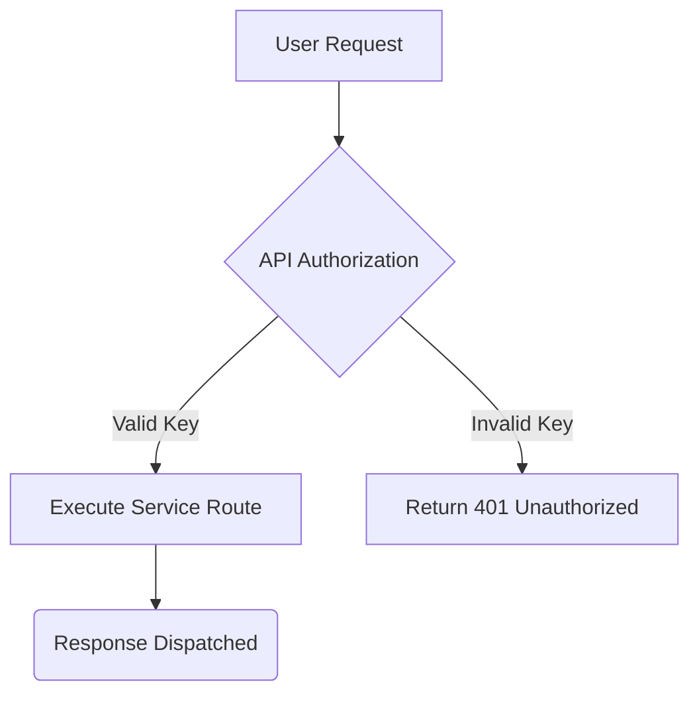
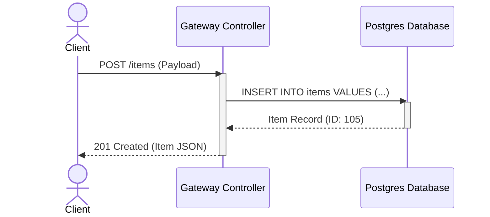
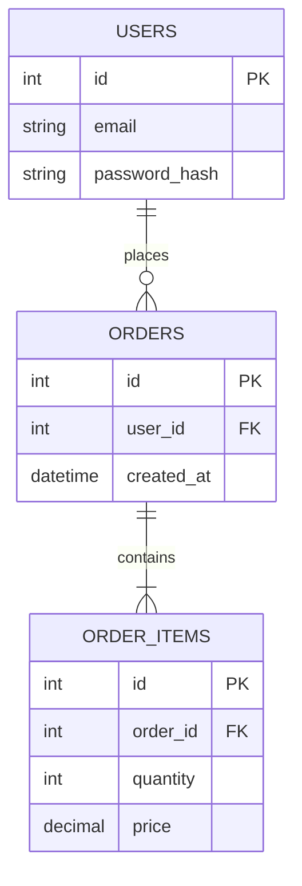

# Mermaid.js Graphic Reference Guide

Mermaid.js allows you to render diagrams, flowcharts, and sitemaps directly inside markdown using code fences.

---

## 1. Flowcharts (`graph` / `flowchart`)
Flowcharts are ideal for representing execution loops, system pipelines, or branching decisions.

### Flowchart Example

### Syntax Rules
- Specify direction: `TD` (top-down), `LR` (left-right), `BT` (bottom-top).
- Quote node labels containing brackets or parentheses to prevent rendering errors: `Node["Label (Info)"]`.

---

## 2. Sequence Diagrams (`sequenceDiagram`)
Sequence diagrams map class interactions, client-server handshake flows, and chronological events.

### Sequence Example

---

## 3. Entity-Relationship Diagrams (`erDiagram`)
ER diagrams detail database schema models, table relationships, and foreign keys.

### ER Example

