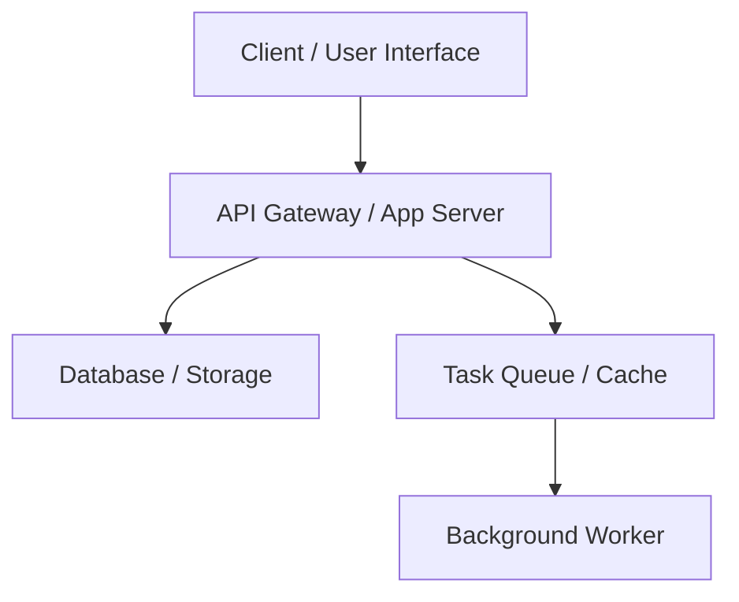

# Software Design Document (SDD): [System Title]

## Metadata
- **Status**: [Draft | Review | Approved | Superceded]
- **Date**: [YYYY-MM-DD]
- **Authors**: Antigravity Design Agent
- **Target Release**: [Version or Timeline]

---

## 1. Executive Summary & Goals
### 1.1 Problem Statement
What business or technical problem does this system solve? Why is it being built?

### 1.2 User Goals & Requirements
- **Goal A**: [...]
- **Goal B**: [...]

### 1.3 Out of Scope
What will this design **not** cover or solve? (Sets boundaries to avoid scope creep).

---

## 2. Architectural Design
Provide a high-level view of the system components and interactions.



### 2.1 Component Breakdown
- **Component A**: [...]
- **Component B**: [...]

### 2.2 System Interactions & Flows
Explain how data moves through the system during primary operations.

---

## 3. Data Model & Storage Design
### 3.1 Schema Design
Provide entity definitions, fields, types, and constraints.

### 3.2 Relationships & Indexes
- **Foreign Keys**: [...]
- **Indexes**: [...]

---

## 4. API & Interface Specifications
List endpoints, methods, inputs, and outputs.

### 4.1 Endpoint: `[METHOD] [PATH]`
- **Description**: [...]
- **Request Headers / Query Parameters**:
  - `[...]`
- **Request Body JSON**:
  ```json
  [...]
  ```
- **Response Body JSON (200 OK)**:
  ```json
  [...]
  ```

---

## 5. Scalability, Performance & Security
- **Concurrency & Scaling**: How does this design handle high traffic? (e.g. caching, workers, pooling).
- **Security & Authorization**: How are inputs sanitized, users authenticated, and data protected?
- **Data Retention & Archival**: [...]

---

## 6. Testing & Rollout Strategy
- **Testing Approach**: How will this design be verified? (Unit, Integration, E2E).
- **Migration & Deploy Plan**: How is data migrated and the code rolled out without downtime?
