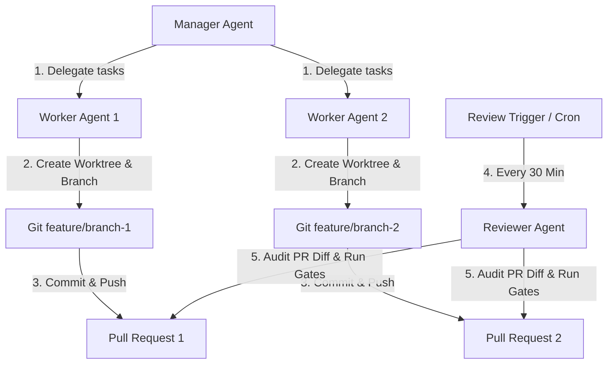

# Loop Engineering & Multi-Agent Orchestration Reference

Loop Engineering is the design and implementation of iterative, self-correcting agent execution loops. This document outlines the architectural patterns for running parallel feature development using manager-worker topologies, workspace isolation (Git Worktrees), and automated code review loops.

---

## 1. Multi-Agent Topology

The architecture divides responsibilities into three specialized roles:



### 1.1 The Manager Agent (Orchestrator)
- Receives high-level user requests.
- Splits the request into independent, parallelizable subtasks.
- Spawns and manages the lifecycle of Worker subagents.

### 1.2 The Worker Agent (Executor)
- Receives a specific, bounded task.
- Works in an isolated workspace (using `Workspace='share'` similar to `git worktree`).
- Creates a dedicated branch (`feature/task-*`).
- Implements the feature, creates unit tests, and commits/pushes the changes to a Pull Request.

### 1.3 The Reviewer Agent (Quality Checker)
- Triggered periodically by a scheduler (e.g. `every(1800)`).
- Fetches open PRs, pulls diffs, and runs automated validations (formatters, linter gates, and test suites).
- Generates review comments and posts feedback directly back to the developer or PR thread.

---

## 2. Workspace Isolation (Git Worktree vs Antigravity Share)

When running agents in parallel, concurrent file writes to the same workspace will cause conflict and corruption. To resolve this:

1. **Antigravity Share Mode**: Spawning subagents with `Workspace='share'` clones the parent repository layout dynamically, allowing independent branch checkouts without duplicating storage.
2. **Git Worktree Isolation**:
   - Each worker runs in its own directory linked to the primary `.git` folder:
     ```bash
     git worktree add ../worktree-feature-1 feature/add-oauth-flow
     ```
   - This ensures file systems are completely isolated, allowing compilers and build processes to run concurrently without interference.

---

## 3. Automated Review Loops (Feedback Cron)

A key pattern in Loop Engineering is the **Automated Auditor Loop**:
- **Triggers**: Schedule execution every 30 minutes.
- **Diff Analysis**: Uses git diff commands to locate additions:
  ```bash
  git diff origin/main...feature/add-oauth-flow
  ```
- **Self-Repair Loop**: If the Reviewer detects compile errors or test failures, it notifies the Manager. The Manager instructs the Worker to check out the branch, fix the issues, and update the PR. This cycle repeats until all quality gates pass.
