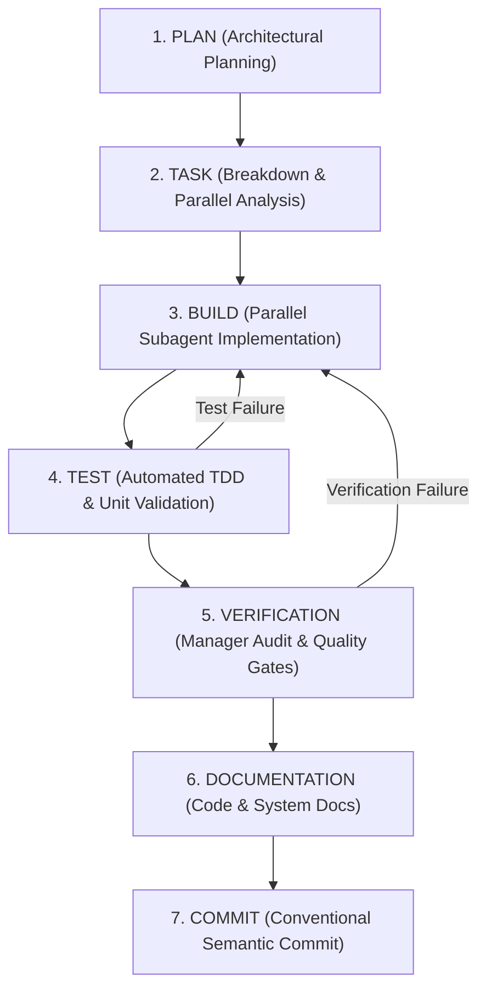

# Rule: Loop Engineering Execution Workflow

**Identifier**: `loop-engineering-workflow`  
**Purpose**: Enforce a mandatory 7-stage Loop Engineering execution cycle (`PLAN -> TASK -> BUILD -> TEST -> VERIFICATION -> DOCUMENTATION -> COMMIT`) with parallel subagent delegation, skill orchestration, quality gates, and manager-level auditing.

---

## 1. Core Mandate & Lifecycle Overview

Every feature implementation, complex refactoring, bug fix, or system modification MUST execute strictly through the **Loop Engineering Cycle**. No stage can be skipped or bypassed.

---

## 2. Detailed Stage Specifications & Skill Integration

### Stage 1: PLAN (Architectural Planning & Alignment)
- **Objective**: Define clear requirements, system architecture, trade-offs, and verifiable success criteria.
- **Rules & Principles**:
  - Apply SOLID, DRY, KISS, and Karpathy guidelines (surgical changes, surfacing assumptions).
  - Do NOT write code without a verified plan.
- **Skill Integrations**:
  - `senior-architect-engineering`: For high-level system design and architectural trade-offs.
  - `design-spec-expert`: For writing detailed Software Design Documents (SDD).
  - `conductor-new-track` / `conductor-setup`: For Conductor project management when applicable.
  - Domain skills (`gemini-api-dev`, `modern-web-guidance`, `fastapi-expert`, `firebase-*`, etc.).

### Stage 2: TASK (Task Breakdown & Parallelization Analysis)
- **Objective**: Break the plan into discrete, atomic sub-tasks and perform static dependency analysis for parallel execution.
- **Parallelization Protocol**:
  - **Dependency Matrix**: Identify tasks with zero shared mutational state and disjoint file sets (e.g., separate API routes, database schemas, frontend components, unit tests, or documentation modules).
  - **Parallel Delegation**: Spawn subagents (`invoke_subagent` with `Workspace='share'` or `Workspace='branch'`) for independent tasks to execute concurrently, saving time and tokens.
  - **Manager Role**: The primary agent acts as **Manager Agent**, assigning specific sub-tasks with precise scopes, monitoring subagents, and preventing scope creep or duplicate work.

### Stage 3: BUILD (Implementation & Code Construction)
- **Objective**: Construct production-ready code fulfilling the specified tasks.
- **Rules & Principles**:
  - Subagents and primary agent build clean, self-documenting code in English.
  - Follow strict type hinting (`mypy` / TypeScript types / Pydantic schemas).
  - No dummy fallbacks, swallow-exceptions, or superficial symptom patches.
- **Skill Integrations**:
  - `python-expert` / `fastapi-expert` / `database-migration-expert`: For Python backend development.
  - `chrome-extensions` / `modern-web-guidance` / `firebase-*`: For frontend & extension development.
  - `google-antigravity-sdk` / `google-agents-cli-adk-code`: For AI agent development.

### Stage 4: TEST (Automated Testing & TDD Cycle)
- **Objective**: Validate correctness through automated test suites and regression checks.
- **Rules & Principles**:
  - Execute existing unit/integration tests and write new test cases covering happy paths, edge cases, and failure boundaries.
  - If a test fails, read exact log tracebacks before making changes. Never guess.
  - Iterate Red-Green-Refactor until 100% of relevant tests pass.
- **Skill Integrations**:
  - `test-driven-development`: Red-Green-Refactor testing cycle.
  - `testing-expert`: Test layout, AAA pattern, mocking boundaries.

### Stage 5: VERIFICATION (Manager Audit & Quality Gates)
- **Objective**: Manager Agent performs comprehensive audit of all subagent outputs and system behavior before sign-off.
- **Rules & Principles**:
  - **Manager Aggregation**: Collect all subagent deliverables, merge branches/results if using isolated worktrees, and verify integration.
  - **Quality Gates**: Run static analysis, linters, code smell checks, and security audits.
  - **Empirical Proof**: Run runtime commands (`pytest`, `npm test`, build scripts) to prove success. Never declare victory without empirical runtime evidence.
- **Skill Integrations**:
  - `build-and-ci-gates`: Verify linters, formatters, and build pipelines.
  - `detect-code-smells`: Audit for SOLID violations, God classes, and debt.
  - `security-audit`: Ensure zero secret leaks or OWASP vulnerabilities.
  - `conductor-review` / `loop-engineering`: For formal review and self-correcting loops.

### Stage 6: DOCUMENTATION (Code & System Documentation)
- **Objective**: Maintain complete, accurate, and up-to-date documentation.
- **Rules & Principles**:
  - Update inline docstrings, comments (explaining *Why*, not *What*), README files, project context, and Mermaid architecture diagrams.
  - Ensure API contracts match implementation exactly.
- **Skill Integrations**:
  - `documentation-expert`: Frameworks, visual templates, and diagram rendering.
  - `repo-research`: Update `.agents/rules/project-context.md` when structural changes occur.

### Stage 7: COMMIT (Conventional Semantic Commit)
- **Objective**: Stage, format, and push semantic commits safely.
- **Rules & Principles**:
  - Use semantic conventional commit message format (`feat: ...`, `fix: ...`, `refactor: ...`, `test: ...`, `docs: ...`).
  - Verify git status, staged files, and branch safety before pushing.
- **Skill Integrations**:
  - `commit-expert`: Commit format validation and local git hooks.
  - `pull-request-expert`: Guidelines for PR descriptions and branch naming.
  - `/commit-push` workflow: Automated trajectory for staging, committing, and pushing.

---

## 3. Manager Agent Checklist & Compliance Matrix

Before declaring any overall goal or complex task complete, the Manager Agent MUST complete this checklist:

- [ ] **Stage 1 (PLAN)**: Was a clear design plan established before coding?
- [ ] **Stage 2 (TASK)**: Were tasks decomposed and parallelized via subagents where appropriate?
- [ ] **Stage 3 (BUILD)**: Is all code written cleanly, adhering to SOLID, DRY, and KISS?
- [ ] **Stage 4 (TEST)**: Did 100% of automated tests pass without skipping assertions?
- [ ] **Stage 5 (VERIFICATION)**: Did the Manager Agent empirically verify all subagent outputs and pass CI/security gates?
- [ ] **Stage 6 (DOCUMENTATION)**: Are all docstrings, READMEs, and diagrams fully updated?
- [ ] **Stage 7 (COMMIT)**: Are commits formatted using semantic conventional commits?
