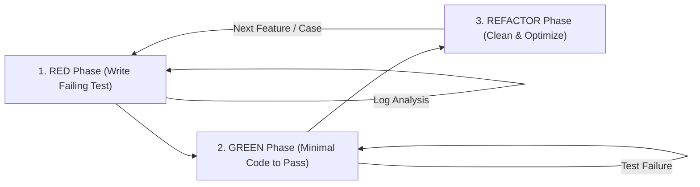

# Rule: Test-Driven Development (TDD) & Agent Verification Best Practices

**Identifier**: `tdd-best-practices`  
**Purpose**: Enforce a strict Test-Driven Development (TDD) mindset (`RED -> GREEN -> REFACTOR`) for Google Antigravity agents, ensuring empirical runtime verification, robust mock boundaries, clean test design, and zero untested features or bug fixes.

---

## 1. Core Mandates for Antigravity Agents

1. **Test First, Code Second**: No production code shall be written or modified without a failing test (RED state) that reproduces the issue or defines the new behavior first.
2. **Empirical Evidence Required**: An agent MUST NOT declare a task completed, bug fixed, or feature built based on static code inspection alone. Clean test execution output (`exit code 0`) is mandatory.
3. **No Symptom Swallowing or Test Tampering**: Never "fix" a failing test by deleting assertions, reducing coverage thresholds, masking exceptions, or returning hardcoded dummy fallbacks.
4. **Surgical Red-Green-Refactor Loops**: Keep iterations small and incremental. Execute relevant tests after *every single code mutation*.

---

## 2. The 3-Phase TDD Lifecycle (`RED -> GREEN -> REFACTOR`)



### Phase 1: RED (Failing Test First)
* **Goal**: Define expected behavior or reproduce a reported bug before touching implementation logic.
* **Actions**:
  1. Write a minimal, clear unit or integration test targeting the function/endpoint/component contract.
  2. Execute the test suite using `run_command` or skill tools.
  3. **Mandatory Step**: Confirm that the test **fails as expected** for the right reason (e.g., `AssertionError`, `NotImplementedError`, missing method).
  4. Inspect the exact stack trace and log output to verify failure alignment.

### Phase 2: GREEN (Make it Pass Minimalist)
* **Goal**: Write the simple, pragmatic code necessary to make the failing test pass.
* **Actions**:
  1. Implement the minimal logic satisfying the test requirements (adhere strictly to KISS and YAGNI).
  2. Run the targeted test suite immediately.
  3. Iterate until 100% of targeted and regression tests pass cleanly.
  4. If execution fails, read the **un-truncated logs**—never guess the root cause.

### Phase 3: REFACTOR (Improve Quality Without Changing Behavior)
* **Goal**: Elevate code quality, readability, maintainability, and architectural structure while keeping tests green.
* **Actions**:
  1. Apply SOLID principles, extract duplicate code (DRY), enforce static type hints, and eliminate code smells.
  2. Re-run tests after every single structural edit to guarantee zero functional regressions.
  3. Ensure docstrings and comments explain *why* decisions were made.

---

## 3. Testing Rules by Scenario

| Scenario | Mandatory TDD Action | Quality Gate |
| :--- | :--- | :--- |
| **New Feature / API** | Write unit and integration tests covering happy paths, edge cases (empty, null, max bounds), and failure states *before* building the feature. | 100% test pass + >80% coverage on new modules. |
| **Bug Fix** | Write a minimal regression test reproducing the exact failure before altering code. Verify test fails, apply fix, verify test turns green. | Regression test proves bug is definitively resolved. |
| **Refactoring** | Run full existing test suite *before* refactoring (must be 100% green). Execute suite after *each* refactor step. | Zero behavior changes; 100% test suite pass rate. |
| **External Integrations (APIs/DBs)** | Mock external network calls and I/O boundaries at the infrastructure layer using clean abstractions/interfaces. | Unit tests execute fast (<2s) and deterministically without network calls. |

---

## 4. Test Design & Structure Standards

### A. The AAA Pattern (Arrange - Act - Assert)
Every test case must follow the AAA structure clearly:

```python
def test_calculate_discount_applies_percentage_correctly():
    # 1. Arrange: Setup inputs, dependencies, and expected outcomes
    calculator = DiscountCalculator(default_rate=0.10)
    original_price = 100.00
    
    # 2. Act: Invoke the target method/behaviour under test
    final_price = calculator.apply_discount(original_price)
    
    # 3. Assert: Validate results explicitly without weak or vague assertions
    assert final_price == 90.00
```

### B. Mocking & Isolation Boundaries
* **Mock External I/O**: Network requests, external API calls (e.g., Gemini API, Firebase, third-party REST services), filesystem writes, and database operations should be mocked in unit tests.
* **Contract Validation**: Ensure mocks adhere to the exact real signature and contracts of production classes/interfaces.
* **Avoid Over-Mocking**: Test core business domain logic with real state transitions rather than mocking internal methods of the class under test.

### C. Test Naming Conventions
Test function names must clearly describe the scenario and expected outcome:
* **Pattern**: `test_<function_or_unit>_<scenario>_<expected_result>()`
* *Good*: `test_user_registration_with_existing_email_raises_duplicate_error()`
* *Bad*: `test_user_1()`, `test_process_fail()`

---

## 5. Antigravity Agent Verification Protocol

Before declaring any coding sub-task, feature, or goal complete, Antigravity agents MUST execute and pass this checklist:

- [ ] **RED Stage Verified**: Did I write/run a test that failed *before* writing the fix or feature?
- [ ] **GREEN Stage Verified**: Did I run the test suite after implementation and receive an explicit pass (`exit code 0`)?
- [ ] **Edge Cases Covered**: Are boundary values, empty collections, null inputs, and expected exceptions explicitly asserted?
- [ ] **No Hidden Errors**: Did I inspect exact execution logs to confirm no unhandled warnings, memory leaks, or deprecations occurred?
- [ ] **REFACTOR Green**: Did all tests remain 100% green throughout structural cleanup and linting checks?
- [ ] **Fast & Deterministic Execution**: Do unit tests execute without non-deterministic delays or flaky real-network calls?
