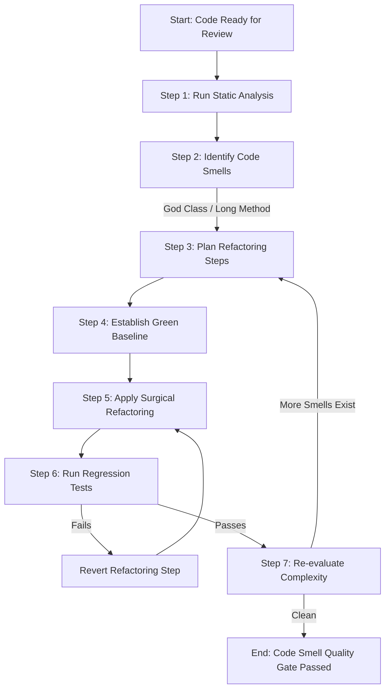

# Workflow: Code Smell Auditing & SOLID Refactoring

**Identifier**: `code-smell-review-workflow`  
**Purpose**: Guide developers and agents through static code analysis, detecting Fowler/Beck code smells, assessing SOLID compliance, and applying risk-free refactoring patterns.

---

## 1. Prerequisites
* Project code compiles and runs successfully.
* Existing test coverage is active and passing (do not refactor code that has no test baseline).

---

## 2. Step-by-Step Workflow



### Step 1: Run Static Analysis & Metrics
* Run AST static analysis, linter checks, and complexity parsers to get raw metric baselines:
  ```bash
  # Python (Complexity scanning with Radon/Ruff)
  radon cc src/ -a
  ruff check src/
  # JS/TS
  npm run lint
  ```

### Step 2: Identify Code Smells
Review the code for these specific structural defects:
1. **Large Classes / God Modules**: Any class file with >300 lines or handling unrelated domains (e.g., handling both DB access and user email notifications).
2. **Long Methods**: Any function exceeding 30-50 lines or containing nested loops/if-conditions deeper than 3 levels (High Cognitive Complexity).
3. **Duplicated Code**: Blocks of identical or highly similar code across modules.
4. **Shotgun Surgery**: Changes in one feature requiring file additions or tweaks across multiple packages.

### Step 3: Plan Refactoring Steps
* Break the refactoring down into tiny, single-focus steps.
* *Example Plan*: 
  1. Extract helper functions out of the main controller module.
  2. Relocate database configurations to a dedicated settings file.
  3. Introduce interface patterns to abstract external API requests.

### Step 4: Establish Green Baseline
* Before modifying any line, run the unit test suite covering the target files:
  ```bash
  pytest tests/test_module.py
  ```
* Ensure 100% of tests are passing. *If there are no tests, write unit tests first before refactoring.*

### Step 5: Apply Surgical Refactoring
* Execute one single step from your refactoring plan at a time.
* **Extraction Pattern**: Extract methods or classes without changing any variable names or interface contracts. Keep changes minimal.
* **Cleanup Dead Code**: Remove old imports, unused parameters, and redundant helper variables that were replaced.

### Step 6: Run Regression Tests
* Run the test suite immediately after the refactoring step:
  ```bash
  pytest tests/test_module.py
  ```
* If tests fail, immediately revert the changes using `git checkout` or `git restore`, isolate what contract broke, and try again with a smaller step.

### Step 7: Re-evaluate Complexity
* Re-run static metrics or Radon analysis. Confirm that Cyclomatic Complexity score is in the A/B range (Score < 10 per function).

---

## 3. Quality Gate & Verification

Before finalizing the refactor, verify:
- [ ] No changes have been made to the public API contracts or external class interfaces (unless explicitly requested).
- [ ] Linter reports 0 errors and code formatter is applied.
- [ ] 100% of tests pass, confirming 0 behavioral regressions.
- [ ] No comments explaining "obvious" lines are left behind.
