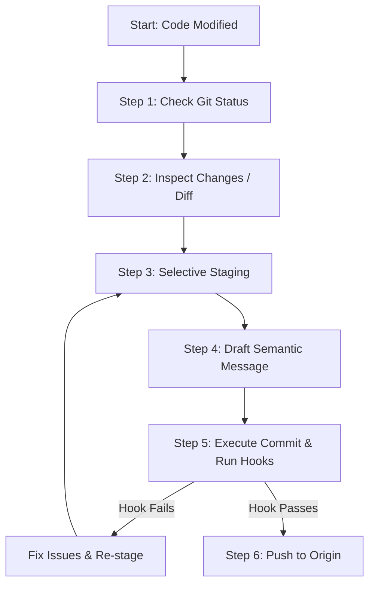

# Workflow: Staging, Committing & Pushing Code

**Identifier**: `commit-workflow`  
**Purpose**: Playbook to guide developers and agents on how to selectively stage changes, write semantic commit messages, validate syntax, and safely push work to version control.

---

## 1. Prerequisites
* Current code is fully working and verified locally via linting/tests.
* Development must be active on an isolated branch (e.g. `feature/name`), never on `main`.

---

## 2. Step-by-Step Workflow



### Step 1: Check Git Status
* Inspect what files have been changed, created, or deleted:
  ```bash
  git status
  ```

### Step 2: Inspect Changes (Diff Check)
* Review the exact line modifications to ensure no experimental code, print statements, or secrets are staged:
  ```bash
  git diff
  ```

### Step 3: Selective Staging
* **Rule**: Avoid `git add .` or `git add -A` unless all changes are strictly related to the same atomic commit. Stage files individually:
  ```bash
  git add path/to/changed_file.py
  git add tests/test_changed_file.py
  ```

### Step 4: Draft Conventional Commit Message
* Draft the message adhering to the Conventional Commit structure:
  * **Header**: `<type>(<scope>): <description>` (max 72 chars, lowercase, imperative mood, no ending period).
  * **Body (Optional)**: Detail *Why* the change was made and *What* is the implementation rationale.
  * **Footer (Optional)**: Link issue numbers (`Closes #14`).

### Step 5: Execute Commit and Run Hooks
* Run the commit command:
  ```bash
  git commit -m "feat(auth): add google oauth provider integration"
  ```
* If pre-commit hooks (linters, formatting gates) fail:
  1. Read the hook error output.
  2. Fix formatting/linting issues in the codebase.
  3. Re-stage the modified files using `git add`.
  4. Run the commit command again.

### Step 6: Safely Push Changes
* Synchronize with remote origin. Always pull before pushing to resolve simple head changes:
  ```bash
  git pull origin feature/your-branch-name --rebase
  git push origin feature/your-branch-name
  ```

---

## 3. Quality Gate & Verification

Before executing `git push`, verify:
- [ ] No local configuration files (e.g. `.env`, keys) are listed in `git status` under "Changes to be committed".
- [ ] The commit message starts with a standard type: `feat`, `fix`, `docs`, `style`, `refactor`, `test`, `build`, `ci`, `chore`.
- [ ] Pre-commit hooks run successfully and returned code `0`.
