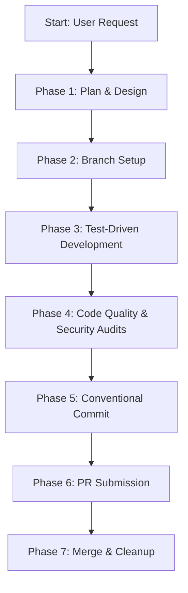

# Workflow: End-to-End Feature Development Cycle

**Identifier**: `feature-development-workflow`  
**Purpose**: Playbook for executing the complete software development lifecycle (SDLC) for new features, incorporating Google Antigravity (AGY) CLI commands, subagents, and context-optimization practices.

---

## 1. Step-by-Step Lifecycle



---

## Phase 1: Plan & Design (Antigravity Optimization)

1. **Understand Requirements & Align**: If there are design decisions or parameters to verify, recommend the user trigger the `/grill-me` slash command to run an interactive design review.
2. **Draft the Implementation Plan**: Trigger the `/plan` slash command to draft a structured, step-by-step checklist of tasks.
3. **Reference Workspace Context**: Use the `@` mention menu in the Antigravity Chat Canvas to attach context files (e.g., schemas, related components, or specialized rules like `@rules/clean-code-and-principles.md`).
4. **Draft Verification Plan**: Explicitly define what test files will be added and what commands will verify success.

---

## Phase 2: Branch Setup

1. **Synchronize Main**: Pull the latest changes from the master/develop branch:
   ```bash
   git checkout main
   git pull origin main
   ```
2. **Create Feature Branch**: Create a feature branch named semantically:
   ```bash
   git checkout -b feature/issue-id-short-description
   ```

---

## Phase 3: Test-Driven Development (TDD) with Subagents

Follow the Red-Green-Refactor sequence. For complex modules, consider delegating test generation to a dedicated subagent so it can run in its own isolated context:
1. **Delegate Test Writing (Optional)**: Spawn a subagent scoped to just "write unit tests for `src/schemas.py`'s registration models" — keep the request self-contained since the subagent starts with no prior context.
2. **Write Unit Tests (Red)**: Write unit tests covering happy path inputs, invalid payloads, and boundary limits. Run tests and verify they fail:
   ```bash
   pytest tests/test_new_feature.py  # Verify failures
   ```
3. **Write Minimum Implementation (Green)**: Write the production code required to make the tests pass. Avoid adding speculative features. Run tests and verify they pass:
   ```bash
   pytest tests/test_new_feature.py  # Verify success
   ```
4. **Refactor Code (Refactor)**: Clean up duplicate logic, long functions, or bad variable names. Run tests after each small change to prevent regressions.

---

## Phase 4: Code Quality & Security Audits

1. **Format & Lint**: Format the codebase and check for static analysis issues:
   ```bash
   ruff format . && ruff check .
   ```
2. **Run Security Sweeps**: Scan for hardcoded credentials and execute static security checks:
   ```bash
   bandit -r src/
   ```
3. **Run Full Test Suite in Background**: If the suite is large, run it as a background task and wait for its completion notification instead of polling the terminal in a loop.

---

## Phase 5: Conventional Commit (Branch Safety Gates)

1. **Selectively Stage**: Check `git status` and stage only files related to the feature. Do not use `git add .` if unnecessary files are changed.
   * *Note*: The Antigravity `PreToolUse` hook will block commits if you are accidentally on the `main` or `develop` branches.
2. **Commit Semantically**: Write commit messages matching the Conventional Commits specification.
3. **Validate the Message**: Run the commit-message validator before finalizing (see the `commit-workflow` playbook).

---

## Phase 6: Pull Request Description & Submission

1. **Rebase feature branch**: Make sure your branch is updated against main to avoid conflicts:
   ```bash
   git fetch origin
   git rebase origin/main
   ```
2. **Push to GitHub**: Push the commits to the remote:
   ```bash
   git push origin feature/issue-id-short-description
   ```
3. **Open Pull Request**: Author a detailed PR description using the project's Pull Request template, documenting the exact commands to run the verification tests. Attach the template using the `@` mention menu if editing or drafting.

---

## Phase 7: Merge & Cleanup

1. **CI/CD Quality Gate**: Ensure all automated build, lint, and test checks pass on GitHub Actions.
2. **Merge PR**: Squash and merge the branch into `main` (or `develop`) to keep commit logs linear.
3. **Cleanup Branch**: Delete your local and remote feature branch to maintain cleanliness:
   ```bash
   git branch -d feature/issue-id-short-description
   git push origin --delete feature/issue-id-short-description
   ```
