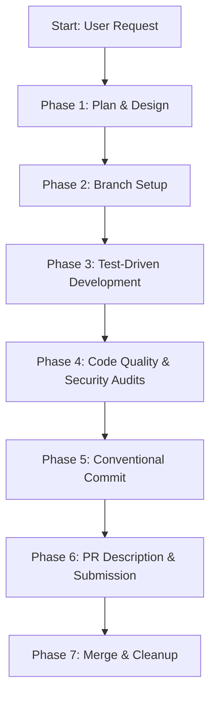

# Workflow: End-to-End Feature Development Cycle

**Identifier**: `feature-development-workflow`  
**Purpose**: Playbook for executing the complete software development lifecycle (SDLC) for new features, ensuring high quality, alignment with design patterns, testing, and branch safety.

---

## 1. Step-by-Step Lifecycle



---

## Phase 1: Plan & Design

1. **Understand Requirements**: Clarify the scope of the feature. Identify any ambiguities before writing code.
2. **Draft Design Specification**: For complex features, write a Software Design Document (SDD) or Architecture Decision Record (ADR) detailing:
   * Architecture design changes.
   * Data models & schema alterations.
   * Internal/External API changes.
3. **Draft Verification Plan**: Explicitly define what test files will be added and what commands will verify success.

---

## Phase 2: Branch Setup

1. **Synchronize Main**: Pull the latest changes from the master/develop branch:
   ```bash
   git checkout main
   git pull origin main
   ```
2. **Create Feature Branch**: Create a feature branch named semantically:
   ```bash
   git checkout -b feature/issue-id-short-description
   ```

---

## Phase 3: Test-Driven Development (TDD)

Follow the Red-Green-Refactor sequence:
1. **Write Schemas & Models**: Setup the structural objects (Pydantic models, TS interfaces, Database schemas).
2. **Write Unit Tests (Red)**: Write unit tests covering happy path inputs, invalid payloads, and boundary limits. Run tests and verify they fail:
   ```bash
   pytest tests/test_new_feature.py  # Verify failures
   ```
3. **Write Minimum Implementation (Green)**: Write the production code required to make the tests pass. Avoid adding speculative features. Run tests and verify they pass:
   ```bash
   pytest tests/test_new_feature.py  # Verify success
   ```
4. **Refactor Code (Refactor)**: Clean up duplicate logic, long functions, or bad variable names. Run tests after each small change to prevent regressions.

---

## Phase 4: Code Quality & Security Audits

1. **Format & Lint**: Format the codebase and check for static analysis issues:
   ```bash
   # Python Example
   ruff format . && ruff check .
   ```
2. **Run Security Sweeps**: Scan for hardcoded credentials and execute static security checks:
   ```bash
   # Scan secrets and code safety
   bandit -r src/
   ```
3. **Run Full Test Suite**: Execute all existing tests to ensure no regressions:
   ```bash
   pytest
   ```

---

## Phase 5: Conventional Commit

1. **Selectively Stage**: Check `git status` and stage only files related to the feature. Do not use `git add .` if unnecessary files are changed:
   ```bash
   git add src/new_feature.py tests/test_new_feature.py
   ```
2. **Commit Semantically**: Write commit messages matching the Conventional Commits specification:
   ```bash
   git commit -m "feat(api): add user registration endpoint"
   ```

---

## Phase 6: Pull Request Description & Submission

1. **Rebase feature branch**: Make sure your branch is updated against main to avoid conflicts:
   ```bash
   git fetch origin
   git rebase origin/main
   ```
2. **Push to GitHub**: Push the commits to the remote:
   ```bash
   git push origin feature/issue-id-short-description
   ```
3. **Open Pull Request**: Author a detailed PR description using the project's Pull Request template, documenting the exact commands to run the verification tests.

---

## Phase 7: Merge & Cleanup

1. **CI/CD Quality Gate**: Ensure all automated build, lint, and test checks pass on GitHub Actions.
2. **Merge PR**: Squash and merge the branch into `main` (or `develop`) to keep commit logs linear.
3. **Cleanup Branch**: Delete your local and remote feature branch to maintain cleanliness:
   ```bash
   git branch -d feature/issue-id-short-description
   git push origin --delete feature/issue-id-short-description
   ```
