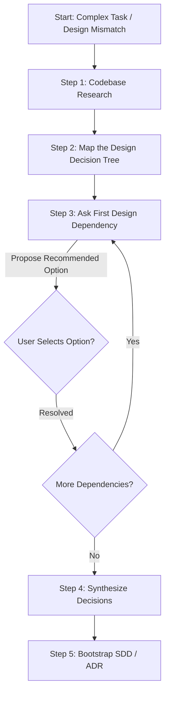

# Workflow: Interactive Design Review & Requirements Gathering (Grill-Me Playbook)

**Identifier**: `grill-me-alignment-workflow`  
**Purpose**: Playbook to guide agents and developers through a structured, interactive design interview to resolve dependencies, clarify specifications, and build a shared understanding of a task before writing code.

---

## 1. Core Principles (The Google `/grill-me` Standard)

When a task requires architectural design choices or has underspecified requirements, the agent must not proceed with assumptions. Instead, run a structured design interview following these rules:
* **Research First**: Seek answers in the codebase and local documentation. Do not ask the user questions that can be answered by reading the files.
* **One at a Time**: Ask design questions sequentially, one by one. Never present a long list of questions that causes developer fatigue.
* **Recommend Solutions**: Never ask open-ended questions without guidance. Always propose a recommended approach with a clear rationale as the first option.
* **Interactive Tooling**: Use standard multi-choice selection patterns (like the `ask_question` modal tool) where choices represent direct user responses.

---

## 2. Step-by-Step Execution Sequence



### Step 1: Codebase Research
* Search the repository for similar implementations, database schemas, and configuration variables.
* Identify the constraints of the active environment (e.g. language version, framework limits, databases).

### Step 2: Map the Design Decision Tree
Group the pending decisions into a logical tree. Resolve dependencies in order (e.g., decide the database structure *before* deciding the API payload schema):
1. **Scope Boundaries**: What is in-scope vs. out-of-scope.
2. **Data Persistence**: Table schemas, relations, migrations.
3. **API Contracts**: Request/response types, validation schemas.
4. **Security & Performance**: Permissions, caching, rate limiting.

### Step 3: Ask First Design Dependency (Sequential Interview)
* Prepare a clean, formatted prompt or launch the `ask_question` tool.
* Structure your prompt as follows:
  * **The Decision**: Name of the design point (e.g. database choice, library choice).
  * **Option A (Recommended)**: Propose the recommended choice based on codebase patterns, with a brief explanation.
  * **Option B, C**: Alternative valid approaches.
* Wait for user selection before introducing the next question.

### Step 4: Synthesize Decisions
* Compile the user's choices into a unified list of design assertions.
* Highlight dependencies that were resolved and identify any remaining gaps.

### Step 5: Bootstrap SDD / ADR
* Generate a Software Design Document (SDD) or Architectural Decision Record (ADR):
  ```bash
  python3 skills/design-spec-expert/scripts/create_sdd.py "New Service Name" Draft
  ```
* Populate the generated document sections (Goals, Architecture, Data Model, API, Testing) with the results of the interview.

---

## 3. Quality Gate & Verification

The requirements gathering workflow is successful when:
- [ ] Every major design branching point has been explicitly resolved.
- [ ] Codebase constraints were verified beforehand to prevent recommending incompatible libraries/approaches.
- [ ] A design specification document (SDD or ADR) has been generated and approved by the user.
- [ ] Both agent and developer share a common, unambiguous understanding of the task boundaries.
