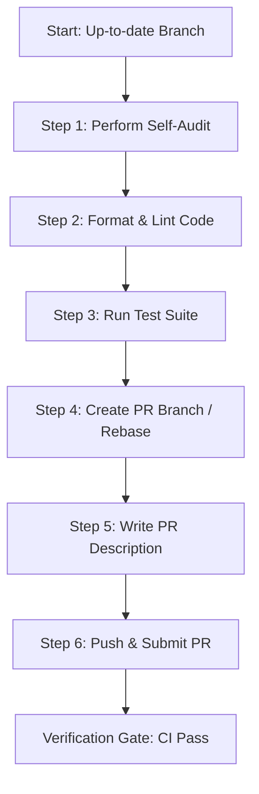

# Workflow: Pull Request Preparation & Submission

**Identifier**: `pull-request-workflow`  
**Purpose**: Guide developers and agents through creating, checking, documenting, and submitting Pull Requests (PRs) that meet high quality standards, using Antigravity context references and branch safety hooks.

---

## 1. Prerequisites
* A clean working directory (no unstaged files or local diffs unrelated to the task).
* Local branch must be synchronized with the remote upstream branch (`git fetch origin`).
* Existing unit and integration tests must be passing successfully.

---

## 2. Step-by-Step Workflow



### Step 1: Perform Self-Audit (AI Review Helper)
* Review the git diff of your changes (`git diff main...HEAD`).
* **Antigravity Best Practice**: If the changes are large, spawn a reviewer subagent scoped to just "audit `git diff main...HEAD` for readability, styling issues, or over-engineering" so its review runs in a clean context.
* Scan for leftovers: remove `print()`, `console.log()`, temporary helper files, or unused imports.
* Ensure no hardcoded tokens, secret files, or local keys are staged.

### Step 2: Format & Lint Code
* Run formatting tools to match repository conventions:
  ```bash
  ruff format . && ruff check .
  ```

### Step 3: Run Test Suite
* Verify that your changes did not introduce regressions by running the test suite locally.
  ```bash
  pytest
  ```

### Step 4: Rebase and Resolve Conflicts
* Ensure your branch is updated with the target branch (`main` or `develop`):
  ```bash
  git checkout main
  git pull origin main
  git checkout feature/your-branch
  git rebase main
  ```
* Resolve conflicts immediately, re-run tests if conflicts were resolved.
* **PreToolUse Hook Safety**: Note that the Antigravity workspace plugin contains hooks that actively block staging or committing changes to the `main` or `develop` branches directly.

### Step 5: Draft the Pull Request Description
* Copy the PR template structure. Create a local draft or populate the PR creation prompt.
* **Ref/Link Clickability**: Make sure to use the `@` mention menu or absolute file URLs to link any modified files, database schemas, or API docs in your description so they are clickable.
  * **Title**: `feat(auth): add google login oauth integration`
  * **Body**: Detail *Why* this change is needed, *What* changed, and *How* it was verified.
  * **Related Issue**: Ensure it includes `Closes #123`.

### Step 6: Push & Submit the PR
* Push your branch to the remote origin:
  ```bash
  git push origin feature/your-branch
  ```
* Open the PR using the GitHub CLI or the GitHub web interface:
  ```bash
  gh pr create --title "feat(auth): add google oauth integration" --body-file pr-description.md
  ```

---

## 3. Quality Gate & Verification

Before requesting review from team members, verify:
- [ ] Linter returns 0 warnings/errors.
- [ ] 100% of unit/integration tests pass.
- [ ] Git branch name matches `feature/*`, `bugfix/*`, or `hotfix/*`.
- [ ] PR description explicitly defines the test execution commands run to verify the code.
