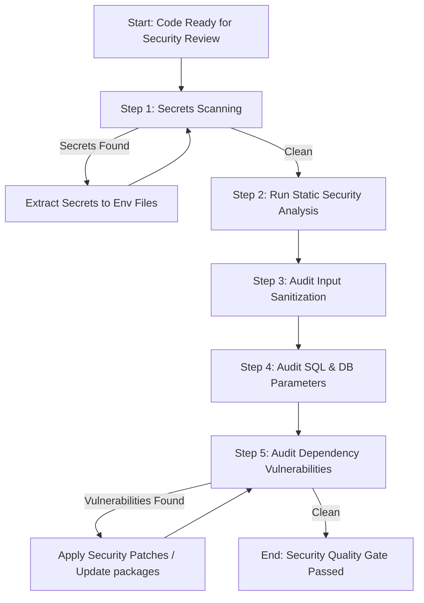

# Workflow: Secure Code Review & Secrets Auditing

**Identifier**: `secure-code-review-workflow`  
**Purpose**: Step-by-step playbook to perform security vulnerability audits, dependency scans, input sanitization checks, and credentials scanning to safeguard projects against OWASP vulnerabilities.

---

## 1. Prerequisites
* Project environment variables and security scanner packages are installed (e.g., `bandit` for Python, `audit` tools, `gitleaks` CLI).
* Pre-existing knowledge of secure design patterns.

---

## 2. Step-by-Step Workflow



### Step 1: Secrets Scanning
* Scan all changed files and commit histories for hardcoded keys, API tokens, passwords, database URLs, and certificates.
* Run a local scanning script or grep search for credential patterns:
  ```bash
  # Example: Find potential environment variables containing secret strings
  grep -rnw . -e "API_KEY" -e "PASSWORD" -e "SECRET" --exclude-dir=node_modules --exclude-dir=.venv
  ```
* **Resolution**: Extract all hardcoded values to a `.env` file (ignored by Git) and fetch them via standard environment configuration (e.g. `os.getenv()`, `process.env`).

### Step 2: Run Static Security Analysis (SAST)
* Execute language-specific static analysis security tools to detect dangerous functions, insecure crypto libraries, or unsafe file operations:
  ```bash
  # Python (using Bandit)
  bandit -r src/
  # Node.js / JavaScript (using ESLint security rules)
  npm run lint
  ```
* Review the report and fix high-severity warnings (e.g. replacing `eval()`, setting proper file permissions, upgrading insecure random number generators to cryptographic ones like `secrets` module).

### Step 3: Audit Input Sanitization (XSS & Path Traversal)
* Check all endpoints and methods that accept user input:
  1. Verify inputs are mapped to strict data schemas (e.g. Pydantic models with type definitions).
  2. Scan for raw string concats on file system paths (`os.path.join` with unsanitized parameters) to prevent Path Traversal.
  3. Ensure user inputs are escaped or sanitized before being rendered in HTML outputs to prevent Cross-Site Scripting (XSS).

### Step 4: Audit SQL & Database Queries (SQLi Prevention)
* Inspect all database queries:
  1. Confirm that SQL query strings are constructed *only* using parameterized placeholders (e.g. `%s`, `:param`, `?`).
  2. Ensure raw database execution functions receive data as a tuple/dictionary of arguments, never as formatted strings:
     * *Bad*: `conn.execute(f"SELECT * FROM users WHERE id = '{user_id}'")`
     * *Good*: `conn.execute("SELECT * FROM users WHERE id = :id", {"id": user_id})`

### Step 5: Audit Dependency Vulnerabilities
* Perform scans on external packages to identify libraries with known CVEs (Common Vulnerabilities and Exposures):
  ```bash
  # Node.js
  npm audit
  # Python (using safety)
  safety check
  ```
* Upgrade package dependencies to safe version patches.

---

## 3. Quality Gate & Verification

The secure code workflow is complete when:
- [ ] Secrets scanner returns 0 findings on staged commit files.
- [ ] SAST analyzer (e.g. Bandit) returns 0 High/Medium severity alerts.
- [ ] All database access points use parameterized queries.
- [ ] Package vulnerability scanner (e.g. `npm audit`) reports 0 critical vulnerabilities.
