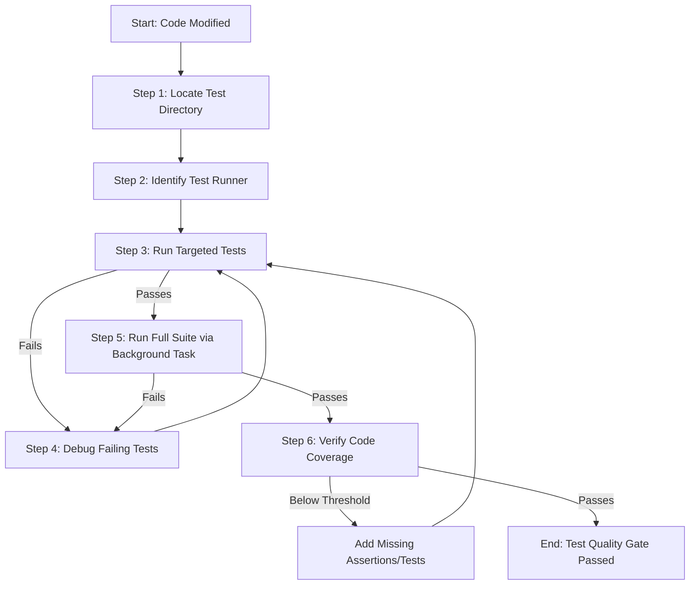

# Workflow: Test Suite Execution & Coverage Verification

**Identifier**: `test-execution-workflow`  
**Purpose**: Step-by-step playbook to locate, configure, run, and audit unit, integration, and coverage tests in any project workspace to guarantee code correctness, leveraging Antigravity background tasks and MCP tools.

---

## 1. Prerequisites
* Project dependencies and test requirements are installed (`pip install -r requirements-dev.txt`, `npm install`, etc.).
* Database or external service mocks are configured or running (e.g., docker-compose for test databases).
* If UI testing is required and a browser-automation MCP server (e.g. `chrome-devtools`) is configured for this project, ensure it's active.

---

## 2. Step-by-Step Workflow



### Step 1: Locate Test Directory
* Find where tests are stored (usually `tests/`, `spec/`, or files ending in `*.test.js`, `test_*.py`).
* Use the `@` mention menu to inspect the files. Verify that test files map to the implementation files modified (e.g., `tests/test_auth.py` matches `src/auth.py`).

### Step 2: Identify Test Runner & Configuration
* Look for runner configuration files in the root:
  * Python: `pytest.ini`, `setup.cfg`, `pyproject.toml`
  * JS/TS: `jest.config.js`, `vitest.config.ts`
  * Go: `go.mod`
* Identify the exact test runner execution command.

### Step 3: Run Targeted Tests (Fast Feedback Loop)
* Run only the tests covering the specific files you changed to save time:
  ```bash
  # Python (pytest)
  pytest tests/test_auth.py -k "test_login"
  # Node.js (Jest)
  npx jest tests/auth.test.js -t "should login user"
  ```
* For UI components, if a browser-automation MCP server is configured, run the app locally and use its tools (e.g. screenshot capture, a Lighthouse audit) to verify visual correctness.

### Step 4: Debug Failing Tests
If a test fails, follow this diagnosis sequence:
1. **Examine Assertions**: Read the traceback output. Isolate whether it is a value assertion mismatch, a Type/Attribute error, or a timeout.
2. **Review Mocks**: If the test hits an external API or database, ensure the request is properly mocked (e.g., using `pytest-mock`, `nock`, or the Firestore emulator for Firebase-backed code).
3. **Isolate Code**: Run the failing test in verbose mode with stdout capturing enabled:
   ```bash
   pytest tests/test_auth.py -s -vv
   ```
4. **Fix & Re-run**: Make targeted adjustments in the source code or mock files, and re-run the targeted test.

### Step 5: Run the Full Test Suite via Background Task
* Run the global project suite to verify no regressions were introduced elsewhere.
* **Antigravity Best Practice**: Run the full test suite in the background and wait for its completion notification instead of polling the terminal in a loop.

### Step 6: Verify Code Coverage
* Execute coverage reporting to check that new statements, branches, and functions are covered:
  ```bash
  pytest --cov=src --cov-report=term-missing
  ```
* Ensure code coverage remains above the project threshold (minimum recommended is **80%** on new files).

---

## 3. Quality Gate & Verification

The testing workflow is considered successful only when:
- [ ] 100% of tests pass (0 failures, 0 errors, 0 pending regressions).
- [ ] Code coverage threshold is met and verified.
- [ ] Test execution logs are outputted and validated.
- [ ] **Editor Stop Hook**: On session termination, the project's automatic `Stop` lifecycle hook runs `verify_tests.py`. If tests fail, the hook blocks task completion.
